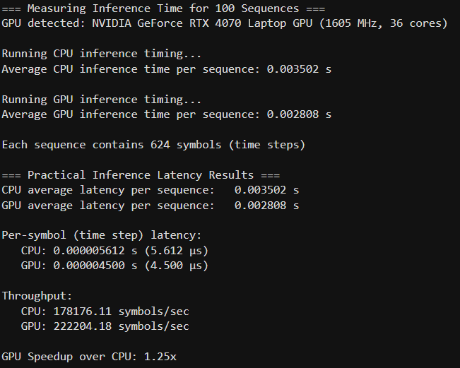

# Results

Final performance comparison between the floating-point software model, the fixed-point (quantized) software model, and the deployed FPGA hardware implementation.

| Metric | Software (Floating Point) | Software (Fixed Point) | Hardware (FPGA) |
|---|---|---|---|
| RMSE | 0.09 | 0.10 | 0.119 |
| Latency | 5.612 µs (CPU) / 4.5 µs (GPU) | — | **3.126 µs** |
| Throughput | 178,176 (CPU) / 222,204 (GPU) | — | **319,264** |

## Interpretation

- **Accuracy cost of quantization is small**: RMSE increases only marginally from 0.09 (FP32 baseline) to 0.119 on hardware — the 24-bit Q3.20 fixed-point scheme (see `step03_ml_model`) preserves prediction quality well.
- **Latency**: the FPGA implementation is faster than even a GPU software inference (3.126 µs vs. 4.5 µs), despite using a simple sequential, single-MAC architecture rather than a fully parallel design.
- **Throughput**: the hardware implementation processes more samples per second than either CPU or GPU software inference, confirming the viability of FPGA acceleration for real-time V2X symbol detection.

## Software Inference Timing (CPU vs GPU)

Measured over 100 sequences of 624 symbols each, on an NVIDIA RTX 4070 Laptop GPU vs CPU. These per-symbol latency and throughput figures form the software-side comparison baseline in the table above.

## Files

See `docs/` for the CNN architecture diagram, and `step0X_*/figures/` for stage-specific plots (training curves, quantization analysis, HDL state machines, resource utilization).
