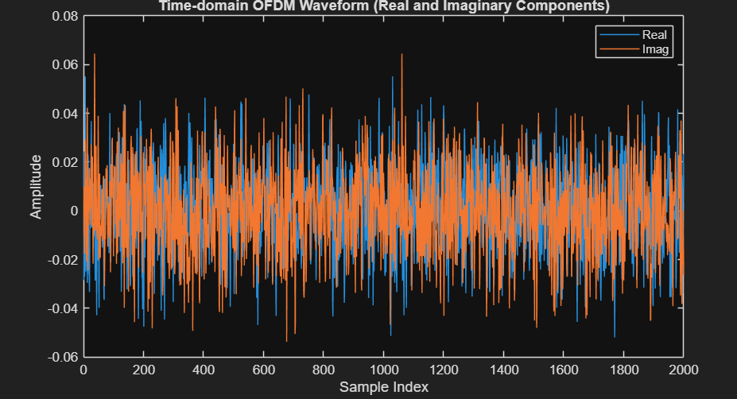
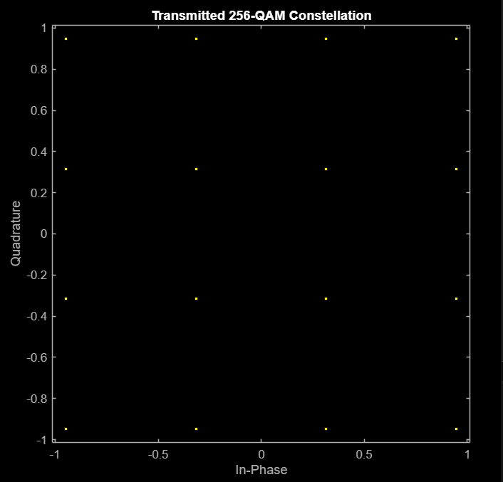
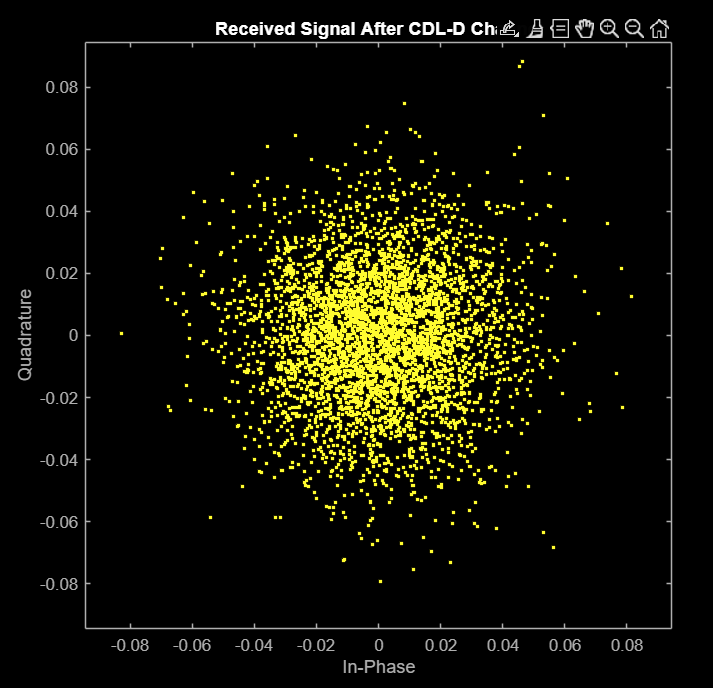

# Step 1: Transmitter & Channel Generation

Generates a standard-compliant 5G NR PDSCH-based OFDM waveform and passes it through a realistic multipath fading channel, forming the simulated "ground truth" signal chain that the rest of the pipeline is built on.

## Files

- `transmitter_main.m` — generates the transmitted OFDM waveform
- `v2x_config_params.m` — central configuration file defining all system parameters (see main README for values)

## Transmitter

`transmitter_main.m` takes the simulation parameters as input and outputs a fully OFDM-modulated transmit waveform, mimicking 5G NR PDSCH standard behaviour. The flow:

1. **Carrier configuration** — subcarrier spacing, resource blocks, and bandwidth (`nrCarrierConfig`)
2. **PDSCH configuration** — antenna count, resource blocks, modulation scheme (`nrPDSCHConfig`)
3. **Bitstream generation** — random bit sequence representing the payload
4. **Encoding** — forward error correction via `nrDLSCH`
5. **Modulation & resource grid mapping** — maps coded bits onto the OFDM resource grid, including the demodulation reference signal
6. **OFDM modulation** — carrier mapping, IFFT, and cyclic prefix insertion (`nrOFDMModulation`)

The output waveform is fed into the channel model; the underlying modulation symbols are what the downstream ML model is trained to predict.

## Channel

The channel is modeled as a Clustered Delay Line (CDL) multipath fading channel (`nrCDLChannel`), configured for a standard Non-Line-of-Sight (NLOS) urban environment representative of real V2X conditions. It simulates multipath fading, Doppler spread, and frequency-selective delay based on the vehicle speed for that iteration.

## Output

- `txWaveform` — transmitted OFDM waveform, fed to the channel
- `txSymbols` — ground-truth modulation symbols (training target for the ML model)
- `carrier`, `pdsch` — configuration objects reused by the receiver for OFDM demodulation
- `rxWaveform` — the channel-distorted received waveform

## Figures

| | |
|---|---|
|  Time-domain OFDM waveform (real & imaginary) |  Transmitted 256-QAM constellation |
|  Received signal after CDL-D channel | |
