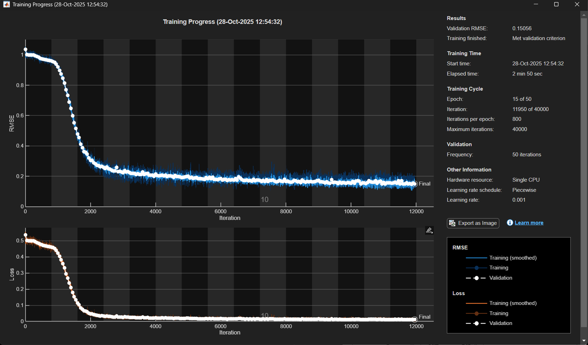
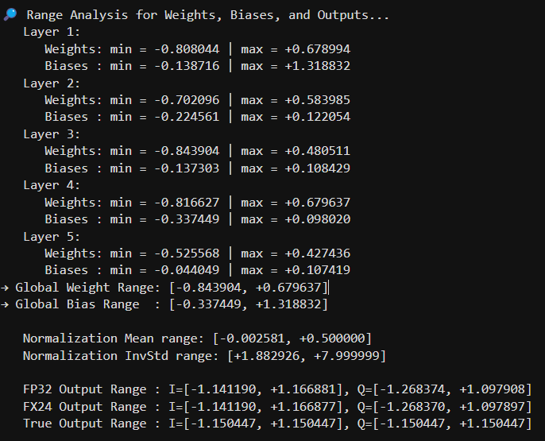
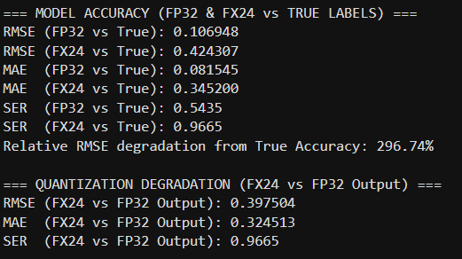
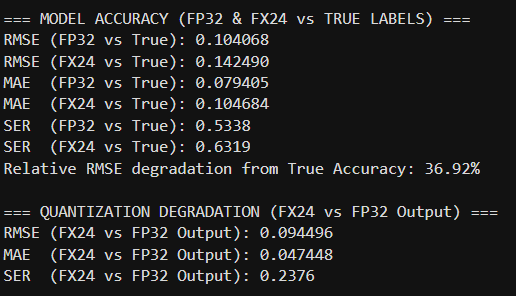
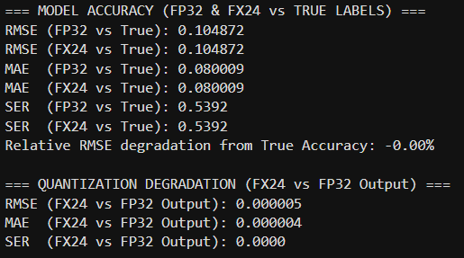
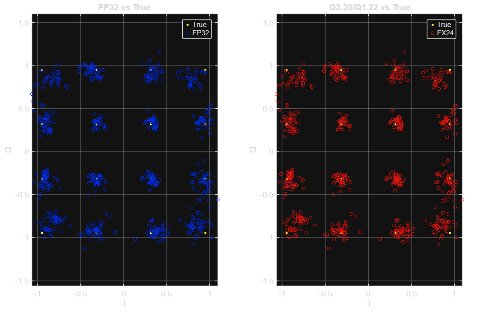

# Step 3: ML Model — Selection, Training & Quantization

## Model Selection

Five architectures were evaluated for accuracy, computational cost, training speed, and — critically — feasibility of FPGA implementation:

| Model | Computational Complexity | Prediction Accuracy |
|---|---|---|
| Support Vector Machine | Low | 40.64% |
| Recurrent Neural Network | Moderate | 86.23% |
| **Convolutional Neural Network** | **Moderate** | **95.67%** |
| Simple Transformer | High | 66.15% |
| Fully Connected Network | Moderate | 44.52%–80.12% |

A **1D CNN** was selected: highest accuracy, moderate computational cost, and — importantly — a structure well suited to FPGA implementation (convolution maps naturally onto DSP blocks, ReLU is trivial in hardware, and the design is feedforward with deterministic timing).

An initial 10-layer CNN performed well but was too large for the target FPGA and risked overfitting. The final architecture is a **5-layer 1D CNN**, sized to fit the DE10-Nano while supporting real-time, sample-by-sample streaming inference.

### Architecture

Input: sequence of `[29 x T]` feature vectors (14 real + 14 imaginary received-signal features + 1 normalized modulation-order feature).

| Layer | Kernel Size | Filters |
|---|---|---|
| Conv1 | 9 | 32 |
| Conv2 | 7 | 64 |
| Conv3 | 5 | 64 |
| Conv4 | 3 | 32 |
| Conv_out | 1 | 2 |

Kernel size shrinks through the network — a "pyramid" scheme that captures coarse-to-fine temporal context while keeping the final layer trivial to stream one sample at a time on hardware. ReLU activations sit between convolutional layers; the output is a regression layer predicting the real/imaginary components of the transmitted symbol.

**Training setup:** Adam optimizer, initial learning rate 1e-3 (halved every 20 epochs), batch size 1 (to match sample-by-sample HDL streaming), He weight initialization, early stopping on validation loss (20-check patience), 80/20 train/test split, MSE loss.

## Files

- `Updated_ML.m` — model definition and training
- `ml_comp_new.m` — model comparison / evaluation
- `auto_scale_acc.m` — fixed-point scaling helper for quantization
- `range_check.m` — verifies intermediate value ranges stay within the chosen fixed-point format

## Quantization

FPGAs require fixed-point arithmetic, so the trained floating-point (FP32) model had to be converted for hardware deployment. The DE10-Nano's DSP blocks are 27×27, so quantization needed to stay at or below 27 bits.

**16-bit and 20-bit quantization were tested first and rejected** — both produced a severe accuracy drop (values fell outside the representable range). **24-bit quantization** was ultimately used, refined through several fixed-point formats before settling on the final scheme:

| Format tested | Range | Result |
|---|---|---|
| Q1.22 | ±2 | Accuracy drop — intermediate values exceeded range |
| Q2.21 | ±4 | Improved, still insufficient |
| **Q3.20 (final)** | **±8** | **No measurable accuracy loss vs. floating-point baseline** |

The final model uses **24-bit fixed-point, Q3.20 format** (1 sign bit, 3 integer bits, 20 fractional bits) throughout the convolutional layers. Quantized weights, biases, inputs, and outputs were exported as `.hex`/`.mif` files for direct use in Quartus memory blocks.

> An earlier 20-bit fixed-point scheme (Q1.18 weights/biases, Q3.16 activations) was also documented during exploration — see `20bit_quantization_experiment.md` — but was superseded by the 24-bit Q3.20 scheme above after it showed unacceptable accuracy degradation.

## Figures

**Training:** 

**Quantization range analysis:** 

**Format search (Q1.22 → Q2.21 → Q3.20 final):**

| Q1.22 (rejected) | Q2.21 (rejected) | Q3.20 (final) |
|---|---|---|
|  |  |  |

**Final Q3.20 output plot:** 

## Output

`SymbolRecoveryModel_UNIVERSAL_further_reduced_HDLCOMPAT.mat` — the trained and quantization-ready model, used to generate the HDL weight/bias ROM files in `step04_hdl_design`.
