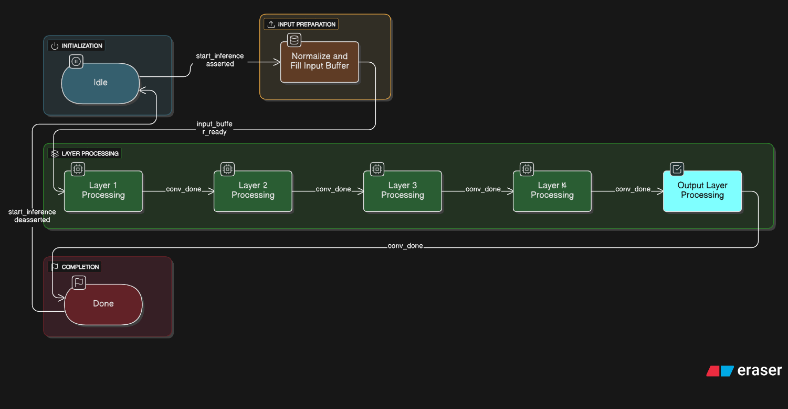
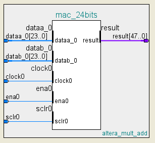
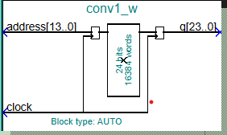
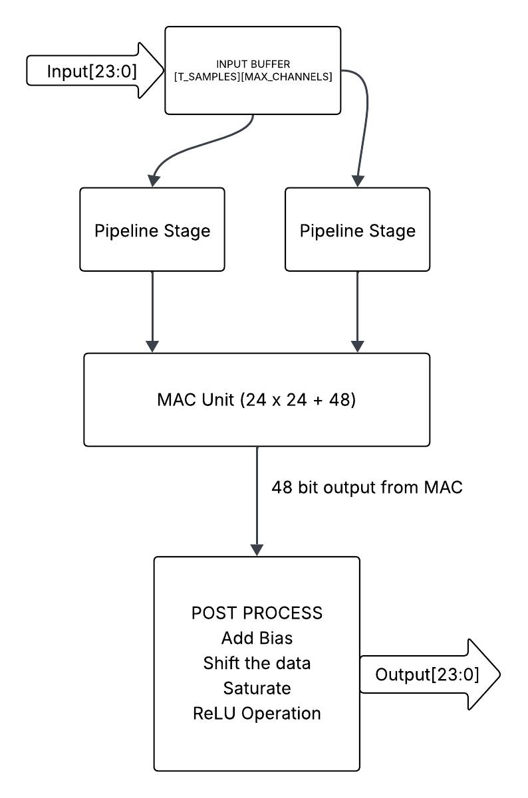
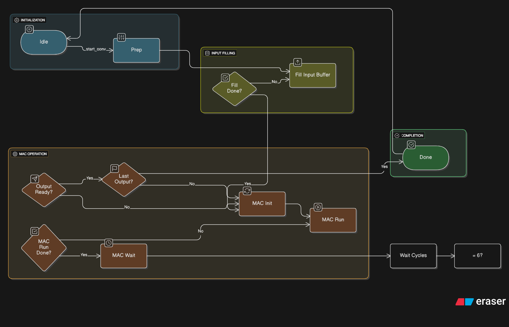

# Step 4: HDL Design

Verilog implementation of the 5-layer 1D CNN receiver, targeting the Intel Cyclone V DE10-Nano (5CSEBA6U23I7) at 50 MHz.

The design processes 29 input channels over 624 time samples (parameterizable) and produces a 2-channel (I/Q) output. It's implemented as a sequential, time-multiplexed architecture — a single reused MAC unit rather than fully parallel per-layer MACs — prioritizing minimal resource usage and modularity over raw speed. (See `step06_hardware_implementation` for a discussion of a parallel-MAC design as a future improvement.)

## Design Goals

- Minimum accuracy loss vs. the trained floating-point model
- Low latency
- Minimum resource usage
- Modular, reusable structure

## Files

- `hex_export1.m` — exports quantized weights/biases from the trained model as `.hex`/`.mif` files for Quartus ROM initialization
- `V files/cnn_top.v` — top-level module, manages data flow between all sub-modules via a state machine
- `V files/cnn_core_conv.v` — convolution core (MAC + ReLU)
- `V files/mac_24bits.v`, `mac_sub.v` — 24-bit MAC implementation
- `V files/norm_module.v`, `norm_mean.v`, `norm_std.v` — Z-score normalization of input data
- `V files/relu.v` — ReLU activation
- `V files/rom_mux.v` — multiplexes the per-layer weight/bias ROMs
- `V files/conv[1-4]_w.v`, `conv[1-4]_b.v`, `conv_out_w.v`, `conv_out_b.v` — per-layer weight/bias ROM modules (with `_bb` black-box wrapper variants)

## Architecture

**Input stage:** raw 24-bit samples are normalized (Z-score, using mean/std ROMs), then streamed through the 5-layer CNN + ReLU pipeline, producing a 24-bit I/Q output.

**MAC:** a single 24×24 MAC (mapped onto the DSP block's native 19×19/27×27 multiplier logic) is reused across all convolutional layers rather than instantiating one MAC per layer, keeping DSP usage low at the cost of throughput.

**Weight/bias ROMs:** generated from the quantized model (see `step03_ml_model`) using Quartus ROM-1 Port IP modules. Sizes:

| ROM | Values | Word Length | Address Width |
|---|---|---|---|
| Conv1 weight | 8,352 | 24 | 14 |
| Conv1 bias | 32 | 24 | 5 |
| Conv2 weight | 14,336 | 24 | 14 |
| Conv2 bias | 64 | 24 | 6 |
| Conv3 weight | 20,480 | 24 | 15 |
| Conv3 bias | 64 | 24 | 6 |
| Conv4 weight | 6,144 | 24 | 13 |
| Conv4 bias | 32 | 24 | 5 |
| Conv_out weight | 64 | 24 | 6 |
| Conv_out bias | 2 | 24 | 1 |

### Top-level state machine (`cnn_top`)

`S_IDLE → S_NORM → S_LAYER1 → S_LAYER2 → S_LAYER3 → S_LAYER4 → S_OUT → S_DONE`

Transitions from `S_IDLE` to `S_NORM` on `start_inference`. Each convolutional layer loads its weights/biases and streams through the convolution core before advancing; once all layers complete, results are returned to the top module.

### Convolution core state machine (`cnn_core_conv`)

`S_IDLE → S_PREP → S_FILL → S_MAC_INIT → S_MAC_RUN → S_MAC_WAIT → S_EMIT → S_DONE`

The MAC produces a 48-bit result (24-bit × 24-bit); `S_MAC_WAIT` handles bias addition, shifting back to the Q3.20 format used throughout the design, and the ReLU operation before emitting results.

## Figures

| | |
|---|---|
|  `cnn_top` module interface |  MAC IP module (Quartus) |
|  ROM mux wrapper |  Convolution core data flow |
|  Convolution core state machine | |
