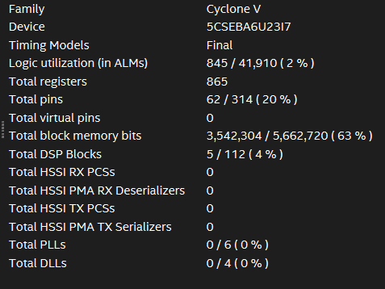
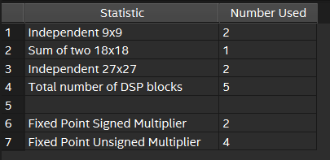
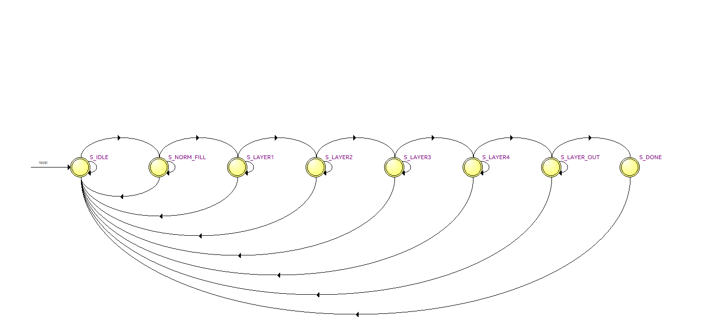

# Step 6: Hardware Implementation

Synthesis, place-and-route, and deployment of the verified HDL design onto the Terasic DE10-Nano (Intel Cyclone V SoC, 5CSEBA6U23I7), using Intel Quartus Prime Lite Edition.

## Files

- `CNN_FPGA.qsf` / `CNN_FPGA.qpf` — Quartus project settings and top-level entity
- `SDC1.sdc` — timing constraints
- `conv[1-4]_[w/b]_ram.qip`, `conv_out_[w/b]_ram.qip` — Quartus IP references for the weight/bias ROMs
- `mac_24bit_ip.qip` / `.ppf` / `.sip` — MAC IP core, pin planning, and simulation IP references
- `CNN_FPGA_nativelink_simulation.rpt` — compilation/synthesis report
- `photos/` — hardware setup and board-in-operation photos

## Synthesis & Resource Utilization

An end-to-end Quartus compile was run on the design.

| Resource | Utilization |
|---|---|
| Logic (ALMs) | 845 / 41,910 (2%) |
| Total registers | 865 |
| Block memory bits | 3,542,304 / 5,662,720 (**63%**) |
| DSP blocks | 5 / 112 (4%) |

**Key observations:**
- The design is **memory-bound, not compute-bound** — block memory (used for weight/bias ROMs) sits at 63% utilization while logic and DSP usage are both in the low single digits.
- Only **one MAC module is reused across all convolutional layers** (a time-multiplexed, sequential architecture), which keeps DSP usage minimal (4%) but limits throughput. The DE10-Nano's DSP blocks max out at 19×19 multipliers; the 24-bit MAC is built from these underlying primitives:

  

- A **32-parallel MAC architecture** was identified as a natural next step — with DSP and logic utilization both this low, there's substantial headroom to trade for significantly higher throughput and lower latency.

**Top-level state machine on hardware:**

Compilation completed with no errors or warnings, passed timing analysis, and successfully completed place-and-route — confirming the design was ready for hardware deployment.

## Deployment

Pin assignments were configured for the DE10-Nano board (see `.qsf`/pin planning files), the board was connected via USB-A, and the bitstream was uploaded and run directly on the board to measure real-world performance.

## Results on Hardware

| Metric | Value |
|---|---|
| RMSE | 0.119 |
| Latency | 3.126 µs |
| Throughput | 319,264 |

Compared to the software baseline (RMSE 0.09–0.10, latency 4.5–5.6 µs), the hardware implementation trades a small amount of accuracy for a substantial latency and throughput improvement — the core result motivating this project. See `results/README.md` for the full comparison.

## Photos

See `photos/` for images of the physical DE10-Nano setup during deployment and testing.
